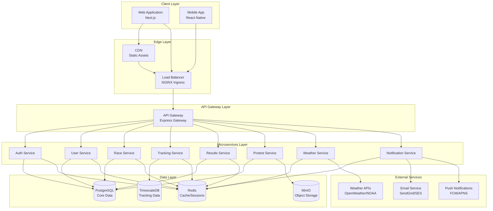
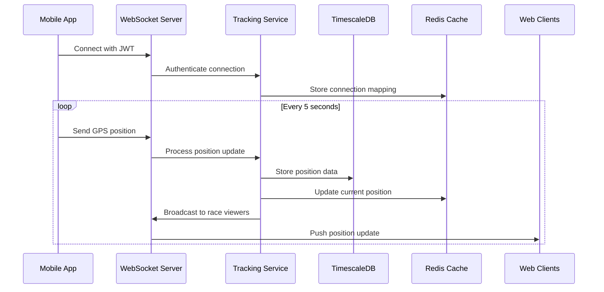
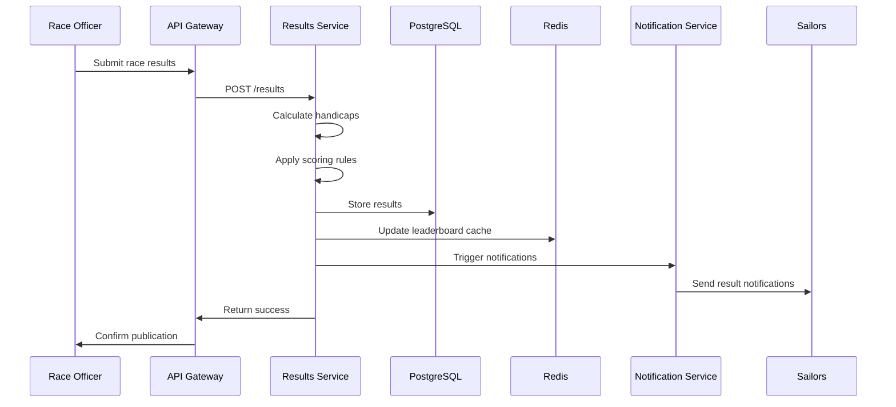
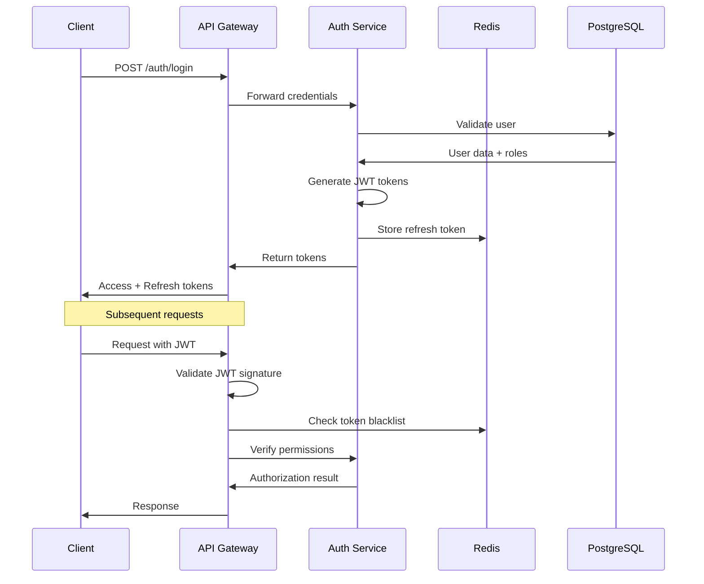
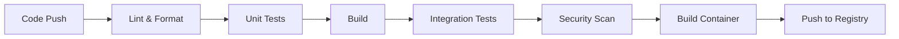
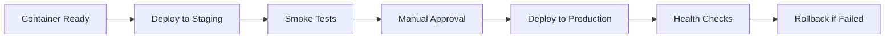

# Technology Requirements and Architecture Document
## Sailing Race Results Application

**Document Version:** 1.0  
**Date:** 2026-05-29  
**Status:** Draft

---

## 1. Executive Summary

This document defines the technical architecture, infrastructure requirements, and technology stack for the Sailing Race Results Application. The system is designed as a cloud-native, microservices-based platform that is cloud-agnostic and built on open-source technologies.

### 1.1 Architecture Principles
- **Cloud-Native**: Containerized, scalable, resilient
- **Cloud-Agnostic**: Portable across cloud providers using Kubernetes
- **Microservices**: Loosely coupled, independently deployable services
- **API-First**: RESTful APIs with OpenAPI specifications
- **Security-First**: Defense in depth, zero-trust principles
- **Observability**: Comprehensive logging, monitoring, and tracing

---

## 2. Technology Stack

### 2.1 Frontend Technologies

#### Web Application
- **Framework**: React 18+ with Next.js 14+
- **Language**: TypeScript 5+
- **State Management**: Redux Toolkit with RTK Query
- **UI Design System**: Carbon Design System (IBM) v11+
- **UI Components**: @carbon/react (Carbon React components)
- **Icons**: @carbon/icons-react
- **Styling**: Carbon themes and SCSS modules
- **Real-Time**: Socket.io-client for WebSocket connections
- **Maps**: Leaflet.js or Mapbox GL JS for race tracking visualization
- **Charts**: @carbon/charts (Carbon Charts for data visualization)
- **Forms**: React Hook Form with Zod validation
- **Testing**: Jest, React Testing Library, Cypress (E2E)

#### Mobile Application
- **Framework**: React Native 0.72+ with Expo
- **Language**: TypeScript 5+
- **Navigation**: React Navigation 6+
- **State Management**: Redux Toolkit
- **UI Design System**: Carbon Design System adapted for mobile
- **UI Components**: Custom Carbon-styled components for React Native
- **Icons**: @carbon/icons-react (web-compatible icons)
- **Maps**: react-native-maps
- **GPS**: expo-location
- **Offline**: Redux Persist with AsyncStorage
- **Push Notifications**: expo-notifications
- **Testing**: Jest, Detox (E2E)

### 2.2 Backend Technologies

#### Core Services
- **Runtime**: Node.js 20 LTS
- **Framework**: Express.js 4.x
- **Language**: TypeScript 5+
- **API Documentation**: Swagger/OpenAPI 3.0
- **Validation**: Zod or Joi
- **Authentication**: Passport.js with JWT strategy
- **Real-Time**: Socket.io for WebSocket server
- **Testing**: Jest, Supertest, Testcontainers

#### Supporting Libraries
- **ORM**: Prisma 5+ (PostgreSQL)
- **Time-Series**: node-postgres with TimescaleDB extensions
- **Caching**: ioredis (Redis client)
- **Object Storage**: MinIO SDK
- **HTTP Client**: Axios
- **Logging**: Winston or Pino
- **Validation**: class-validator, class-transformer

### 2.3 Data Storage

#### Primary Database
- **System**: PostgreSQL 16+
- **Purpose**: Core relational data (users, clubs, races, results)
- **Features**: ACID compliance, JSONB support, full-text search
- **Replication**: Primary-replica setup for read scaling
- **Backup**: Automated daily backups with point-in-time recovery

#### Time-Series Database
- **System**: TimescaleDB 2.13+ (PostgreSQL extension)
- **Purpose**: GPS tracking data, performance metrics
- **Features**: Automatic partitioning, compression, continuous aggregates
- **Retention**: 90 days full resolution, 2 years aggregated

#### Cache Layer
- **System**: Redis 7+
- **Purpose**: Session storage, API caching, real-time data
- **Features**: Pub/Sub for WebSocket scaling, sorted sets for leaderboards
- **Persistence**: RDB snapshots + AOF for durability
- **Clustering**: Redis Sentinel for high availability

#### Object Storage
- **System**: MinIO (S3-compatible)
- **Purpose**: User uploads, race documents, protest evidence, track exports
- **Features**: Versioning, lifecycle policies, encryption at rest
- **Backup**: Cross-region replication (future)

### 2.4 Infrastructure & DevOps

#### Container Orchestration
- **Platform**: Kubernetes 1.28+
- **Distribution**: Cloud-agnostic (works with any K8s provider)
- **Ingress**: NGINX Ingress Controller
- **Service Mesh**: Istio (optional, for advanced traffic management)
- **Package Manager**: Helm 3+ for application deployment

#### CI/CD Pipeline
- **Version Control**: Git (GitHub, GitLab, or Bitbucket)
- **CI/CD**: GitHub Actions, GitLab CI, or Jenkins
- **Container Registry**: Harbor or cloud provider registry
- **Image Scanning**: Trivy for vulnerability scanning
- **Deployment Strategy**: Blue-green or canary deployments

#### Monitoring & Observability
- **Metrics**: Prometheus + Grafana
- **Logging**: ELK Stack (Elasticsearch, Logstash, Kibana) or Loki
- **Tracing**: Jaeger or Zipkin (OpenTelemetry)
- **APM**: Optional integration with Datadog or New Relic
- **Alerting**: Prometheus Alertmanager + PagerDuty/Slack

#### Security Tools
- **Secrets Management**: Sealed Secrets or External Secrets Operator
- **Certificate Management**: cert-manager with Let's Encrypt
- **Network Policies**: Kubernetes NetworkPolicies
- **Vulnerability Scanning**: Trivy, Snyk
- **WAF**: ModSecurity or cloud provider WAF

---

## 3. System Architecture

### 3.1 High-Level Architecture



### 3.2 Microservices Architecture

#### Service Breakdown

**1. Authentication Service**
- **Responsibility**: User authentication, authorization, token management
- **Endpoints**: `/auth/login`, `/auth/register`, `/auth/refresh`, `/auth/logout`
- **Database**: PostgreSQL (users, roles, permissions), Redis (sessions)
- **Dependencies**: None (foundational service)

**2. User Service**
- **Responsibility**: User profile management, club membership
- **Endpoints**: `/users`, `/users/:id`, `/users/:id/boats`, `/users/:id/stats`
- **Database**: PostgreSQL (user profiles, boats)
- **Dependencies**: Auth Service

**3. Race Service**
- **Responsibility**: Race creation, management, registration
- **Endpoints**: `/races`, `/races/:id`, `/races/:id/register`, `/races/:id/series`
- **Database**: PostgreSQL (races, registrations, series)
- **Dependencies**: Auth Service, User Service

**4. Tracking Service**
- **Responsibility**: Real-time GPS tracking, position updates
- **Endpoints**: `/tracking/position`, `/tracking/race/:id/live`, `/tracking/history/:id`
- **Database**: TimescaleDB (position data), Redis (real-time cache)
- **Dependencies**: Auth Service, Race Service
- **Real-Time**: WebSocket server for live updates

**5. Results Service**
- **Responsibility**: Result entry, scoring, handicap calculations, leaderboards
- **Endpoints**: `/results`, `/results/:raceId`, `/results/series/:seriesId`, `/leaderboards`
- **Database**: PostgreSQL (results, scores), Redis (leaderboard cache)
- **Dependencies**: Auth Service, Race Service

**6. Protest Service**
- **Responsibility**: Protest submission, hearing management, decisions
- **Endpoints**: `/protests`, `/protests/:id`, `/protests/:id/evidence`, `/protests/:id/decision`
- **Database**: PostgreSQL (protests, decisions), MinIO (evidence files)
- **Dependencies**: Auth Service, Race Service, Results Service

**7. Weather Service**
- **Responsibility**: Weather data aggregation, caching, historical storage
- **Endpoints**: `/weather/current/:location`, `/weather/forecast/:location`, `/weather/race/:raceId`
- **Database**: Redis (cache), PostgreSQL (historical data)
- **Dependencies**: External Weather APIs
- **Caching**: 15-minute cache for current, 1-hour for forecasts

**8. Notification Service**
- **Responsibility**: Email, push notifications, in-app notifications
- **Endpoints**: `/notifications`, `/notifications/send`, `/notifications/preferences`
- **Database**: PostgreSQL (notification preferences), Redis (queue)
- **Dependencies**: Auth Service, User Service
- **Queue**: Redis-based message queue

### 3.3 Data Flow Patterns

#### Real-Time Tracking Flow


#### Result Publication Flow


---

## 4. Infrastructure Architecture

### 4.1 Kubernetes Cluster Design

#### Cluster Configuration
- **Node Pools**:
  - **System Pool**: 2-3 nodes for system components (monitoring, ingress)
  - **Application Pool**: 3-5 nodes for microservices (auto-scaling)
  - **Data Pool**: 3 nodes for stateful workloads (databases)
- **Node Specifications**:
  - System: 2 vCPU, 4GB RAM
  - Application: 4 vCPU, 8GB RAM
  - Data: 4 vCPU, 16GB RAM, SSD storage

#### Namespace Organization
- `production`: Production workloads
- `staging`: Staging environment
- `monitoring`: Prometheus, Grafana, logging
- `ingress`: NGINX Ingress Controller
- `cert-manager`: Certificate management
- `data`: Database operators and stateful sets

### 4.2 Deployment Architecture

#### Service Deployment Specifications

**Frontend (Next.js)**
```yaml
Replicas: 3
Resources:
  CPU: 500m (request), 1000m (limit)
  Memory: 512Mi (request), 1Gi (limit)
Autoscaling: HPA based on CPU (50-80%)
Health Checks: /api/health
```

**Backend Microservices**
```yaml
Replicas: 2-3 per service
Resources:
  CPU: 250m (request), 500m (limit)
  Memory: 256Mi (request), 512Mi (limit)
Autoscaling: HPA based on CPU and memory
Health Checks: /health, /ready
```

**Tracking Service (High Load)**
```yaml
Replicas: 3-5
Resources:
  CPU: 500m (request), 1000m (limit)
  Memory: 512Mi (request), 1Gi (limit)
Autoscaling: HPA based on WebSocket connections
```

**PostgreSQL**
```yaml
Deployment: StatefulSet with persistent volumes
Replicas: 1 primary + 2 read replicas
Resources:
  CPU: 2000m (request), 4000m (limit)
  Memory: 4Gi (request), 8Gi (limit)
Storage: 100GB SSD (expandable)
Backup: Daily automated backups
```

**TimescaleDB**
```yaml
Deployment: StatefulSet with persistent volumes
Replicas: 1 (single instance initially)
Resources:
  CPU: 1000m (request), 2000m (limit)
  Memory: 2Gi (request), 4Gi (limit)
Storage: 200GB SSD (expandable)
Compression: Enabled for data older than 7 days
```

**Redis**
```yaml
Deployment: StatefulSet with Redis Sentinel
Replicas: 3 (1 master + 2 replicas)
Resources:
  CPU: 500m (request), 1000m (limit)
  Memory: 1Gi (request), 2Gi (limit)
Persistence: RDB + AOF
```

**MinIO**
```yaml
Deployment: StatefulSet
Replicas: 4 (distributed mode)
Resources:
  CPU: 500m (request), 1000m (limit)
  Memory: 1Gi (request), 2Gi (limit)
Storage: 500GB per node (2TB total)
```

### 4.3 Network Architecture

#### Ingress Configuration
- **TLS Termination**: At ingress level with Let's Encrypt certificates
- **Rate Limiting**: 100 requests/minute per IP for API endpoints
- **CORS**: Configured per service with allowed origins
- **WebSocket Support**: Sticky sessions for tracking service

#### Service Mesh (Optional)
- **Implementation**: Istio for advanced traffic management
- **Features**: Circuit breaking, retry logic, traffic splitting
- **Observability**: Automatic tracing and metrics collection

#### Network Policies
- Default deny all traffic
- Explicit allow rules for service-to-service communication
- Database access restricted to specific services
- External API access only from designated services

---

## 5. Security Architecture

### 5.1 Authentication & Authorization

#### Authentication Flow


#### JWT Token Structure
```json
{
  "sub": "user-id",
  "email": "user@example.com",
  "roles": ["sailor", "race_officer"],
  "club_id": "club-123",
  "iat": 1234567890,
  "exp": 1234571490
}
```

#### Role-Based Access Control (RBAC)
- **Roles**: sailor, race_officer, scorer, protest_committee, club_admin, federation_admin, system_admin
- **Permissions**: Granular permissions per endpoint
- **Enforcement**: Middleware at API Gateway and service level

### 5.2 Data Security

#### Encryption
- **In Transit**: TLS 1.3 for all external communication
- **At Rest**: AES-256 encryption for databases and object storage
- **Application Level**: Sensitive fields (passwords) hashed with bcrypt

#### Data Privacy
- **GDPR Compliance**: Data minimization, consent management, right to erasure
- **Data Retention**: Configurable retention policies per data type
- **Anonymization**: Personal data anonymization for analytics

#### Secrets Management
- **Storage**: Kubernetes Secrets with encryption at rest
- **Rotation**: Automated secret rotation for database credentials
- **Access**: Secrets injected as environment variables or mounted volumes

### 5.3 API Security

#### Rate Limiting
- **Global**: 1000 requests/hour per user
- **Endpoint-Specific**: Stricter limits for sensitive operations
- **Implementation**: Redis-based rate limiting

#### Input Validation
- **Schema Validation**: Zod schemas for all API inputs
- **Sanitization**: XSS and SQL injection prevention
- **File Uploads**: Type validation, size limits, virus scanning

#### API Authentication
- **JWT Tokens**: Short-lived access tokens (15 minutes)
- **Refresh Tokens**: Long-lived (7 days), stored in Redis
- **API Keys**: For service-to-service communication

---

## 6. Scalability & Performance

### 6.1 Horizontal Scaling

#### Auto-Scaling Configuration
- **Metrics**: CPU utilization, memory usage, request rate
- **Thresholds**: Scale up at 70% CPU, scale down at 30%
- **Limits**: Min 2, Max 10 replicas per service
- **Cool-down**: 5 minutes between scaling events

#### Database Scaling
- **Read Replicas**: 2 read replicas for PostgreSQL
- **Connection Pooling**: PgBouncer for connection management
- **Query Optimization**: Indexed queries, materialized views
- **Caching**: Redis for frequently accessed data

### 6.2 Performance Optimization

#### Caching Strategy
- **Browser Cache**: Static assets cached for 1 year
- **CDN Cache**: Edge caching for static content
- **API Cache**: Redis caching for read-heavy endpoints
- **Database Cache**: Query result caching with TTL

#### Database Optimization
- **Indexing**: Strategic indexes on frequently queried columns
- **Partitioning**: TimescaleDB automatic partitioning for tracking data
- **Compression**: TimescaleDB compression for historical data
- **Archival**: Move old data to cold storage after 2 years

#### Real-Time Optimization
- **WebSocket Pooling**: Connection pooling and reuse
- **Message Batching**: Batch position updates for efficiency
- **Redis Pub/Sub**: Distribute WebSocket messages across instances
- **Backpressure**: Handle slow clients without blocking others

## 6.4 Carbon Design System Implementation

### 6.4.1 Design System Overview
The application will use IBM's Carbon Design System to ensure a consistent, accessible, and professional user interface across all platforms.

#### Carbon Design Principles
- **Clarity**: Clear visual hierarchy and intuitive interactions
- **Efficiency**: Streamlined workflows and minimal cognitive load
- **Consistency**: Unified design language across all touchpoints
- **Accessibility**: WCAG 2.1 Level AA compliance built-in

### 6.4.2 Web Application Implementation

#### Core Carbon Packages
```json
{
  "@carbon/react": "^1.40.0",
  "@carbon/icons-react": "^11.30.0",
  "@carbon/charts": "^1.15.0",
  "@carbon/charts-react": "^1.15.0",
  "carbon-components": "^10.58.0"
}
```

#### Theme Configuration
- **Primary Theme**: White theme (default)
- **Dark Mode**: G100 theme for low-light conditions
- **Custom Theme**: Sailing-specific color palette based on Carbon tokens
- **Theme Switching**: User preference with system detection

#### Key Components Usage
- **Navigation**: Carbon Header, SideNav for main navigation
- **Data Display**: DataTable for race results and leaderboards
- **Forms**: Carbon form components with built-in validation
- **Maps**: Custom integration with Leaflet using Carbon styling
- **Charts**: Carbon Charts for performance analytics
- **Notifications**: Carbon Toast notifications for real-time updates
- **Modals**: Carbon Modal for dialogs and confirmations

#### Layout Structure
```
┌─────────────────────────────────────┐
│ Carbon Header (Navigation)          │
├──────┬──────────────────────────────┤
│ Side │ Main Content Area            │
│ Nav  │ - Carbon Grid System         │
│      │ - Responsive Breakpoints     │
│      │ - Carbon Spacing Tokens      │
└──────┴──────────────────────────────┘
```

### 6.4.3 Mobile Application Implementation

#### Carbon for React Native
- **Approach**: Custom component library inspired by Carbon Design System
- **Color Tokens**: Use Carbon color palette
- **Typography**: Carbon type scale adapted for mobile
- **Spacing**: Carbon spacing tokens (2px, 4px, 8px, 16px, 32px, 64px)
- **Icons**: Carbon icons adapted for React Native

#### Mobile-Specific Considerations
- Touch-friendly component sizing (minimum 44x44pt)
- Bottom navigation for primary actions
- Swipe gestures following Carbon patterns
- Native platform conventions where appropriate

### 6.4.4 Design Tokens

#### Color Palette
```scss
// Primary colors
$blue-60: #0f62fe;  // Primary action color
$blue-70: #0353e9;  // Hover state

// UI colors
$ui-background: #ffffff;
$ui-01: #f4f4f4;
$ui-02: #ffffff;
$text-01: #161616;
$text-02: #525252;

// Status colors
$support-success: #24a148;
$support-error: #da1e28;
$support-warning: #f1c21b;
$support-info: #0043ce;
```

#### Typography Scale
```scss
// Carbon type scale
$heading-01: 14px / 18px (0.875rem / 1.125rem)
$heading-02: 16px / 22px (1rem / 1.375rem)
$heading-03: 20px / 26px (1.25rem / 1.625rem)
$heading-04: 28px / 36px (1.75rem / 2.25rem)
$heading-05: 32px / 40px (2rem / 2.5rem)

$body-short-01: 14px / 18px
$body-short-02: 16px / 22px
$body-long-01: 14px / 20px
$body-long-02: 16px / 24px
```

#### Spacing Scale
```scss
// Carbon spacing tokens
$spacing-01: 2px;
$spacing-02: 4px;
$spacing-03: 8px;
$spacing-04: 12px;
$spacing-05: 16px;
$spacing-06: 24px;
$spacing-07: 32px;
$spacing-08: 40px;
$spacing-09: 48px;
```

### 6.4.5 Accessibility Features

#### Built-in Carbon Accessibility
- ARIA labels and roles on all interactive elements
- Keyboard navigation support
- Focus indicators meeting WCAG standards
- Screen reader compatibility
- Color contrast ratios meeting AA standards
- Responsive text sizing

#### Custom Accessibility Enhancements
- Skip navigation links
- Descriptive alt text for race maps
- Live regions for real-time race updates
- Accessible data tables with proper headers
- Form validation with clear error messages

### 6.4.6 Responsive Design

#### Breakpoints (Carbon Grid)
```scss
$breakpoint-sm: 320px;   // Small devices
$breakpoint-md: 672px;   // Medium devices
$breakpoint-lg: 1056px;  // Large devices
$breakpoint-xlg: 1312px; // Extra large devices
$breakpoint-max: 1584px; // Maximum width
```

#### Grid System
- 16-column grid for large screens
- 8-column grid for medium screens
- 4-column grid for small screens
- Fluid gutters using Carbon spacing tokens

### 6.4.7 Component Library Structure

```
src/
├── components/
│   ├── common/
│   │   ├── Button/          # Carbon Button wrapper
│   │   ├── Input/           # Carbon TextInput wrapper
│   │   ├── Card/            # Carbon Tile wrapper
│   │   └── Modal/           # Carbon Modal wrapper
│   ├── navigation/
│   │   ├── Header/          # Carbon Header
│   │   ├── SideNav/         # Carbon SideNav
│   │   └── Breadcrumb/      # Carbon Breadcrumb
│   ├── data-display/
│   │   ├── DataTable/       # Carbon DataTable
│   │   ├── RaceMap/         # Custom map with Carbon styling
│   │   └── Leaderboard/     # Custom component
│   └── forms/
│       ├── RaceForm/        # Carbon form components
│       └── RegistrationForm/
├── styles/
│   ├── themes/
│   │   ├── white.scss       # Default theme
│   │   ├── g100.scss        # Dark theme
│   │   └── sailing.scss     # Custom theme
│   └── tokens/
│       ├── colors.scss
│       ├── spacing.scss
│       └── typography.scss
```

### 6.4.8 Performance Considerations

#### Carbon Optimization
- Tree-shaking to include only used components
- Code splitting for Carbon components
- Lazy loading of heavy components (DataTable, Charts)
- CSS-in-JS optimization with Carbon styles
- Icon sprite sheets for Carbon icons

#### Bundle Size Management
- Estimated Carbon bundle size: ~150KB (gzipped)
- Use Carbon's modular imports
- Implement dynamic imports for charts
- Optimize Carbon theme switching

---

---

## 7. Monitoring & Observability

### 7.1 Metrics Collection

#### Application Metrics
- **Request Rate**: Requests per second per endpoint
- **Response Time**: P50, P95, P99 latencies
- **Error Rate**: 4xx and 5xx error percentages
- **Active Users**: Concurrent users and sessions
- **WebSocket Connections**: Active connections per instance

#### Infrastructure Metrics
- **CPU Usage**: Per pod and node
- **Memory Usage**: Per pod and node
- **Network I/O**: Ingress and egress traffic
- **Disk Usage**: Storage utilization and IOPS
- **Pod Health**: Restart count, readiness status

#### Business Metrics
- **Race Activity**: Races created, completed, participants
- **User Engagement**: Active users, feature usage
- **Performance**: Result publication time, tracking accuracy
- **Errors**: Failed operations, user-reported issues

### 7.2 Logging Strategy

#### Log Levels
- **ERROR**: Application errors requiring attention
- **WARN**: Potential issues, degraded performance
- **INFO**: Important business events
- **DEBUG**: Detailed diagnostic information (non-production)

#### Log Aggregation
- **Collection**: Fluentd or Filebeat
- **Storage**: Elasticsearch (30 days retention)
- **Visualization**: Kibana dashboards
- **Alerting**: ElastAlert for critical errors

#### Structured Logging
```json
{
  "timestamp": "2026-05-29T08:00:00Z",
  "level": "INFO",
  "service": "race-service",
  "trace_id": "abc123",
  "user_id": "user-456",
  "message": "Race created successfully",
  "metadata": {
    "race_id": "race-789",
    "club_id": "club-123"
  }
}
```

### 7.3 Distributed Tracing

#### Trace Implementation
- **Library**: OpenTelemetry
- **Backend**: Jaeger
- **Sampling**: 10% of requests in production
- **Context Propagation**: Trace IDs across service boundaries

#### Trace Spans
- HTTP requests
- Database queries
- External API calls
- Cache operations
- Message queue operations

---

## 8. Disaster Recovery & Business Continuity

### 8.1 Backup Strategy

#### Database Backups
- **Frequency**: Daily automated backups
- **Retention**: 30 days for daily, 12 months for monthly
- **Type**: Full backups with point-in-time recovery
- **Storage**: Off-cluster object storage
- **Testing**: Monthly restore tests

#### Application State
- **Configuration**: Version controlled in Git
- **Secrets**: Backed up in secure vault
- **Object Storage**: Cross-region replication (future)

### 8.2 Disaster Recovery Plan

#### Recovery Objectives
- **RTO (Recovery Time Objective)**: 4 hours
- **RPO (Recovery Point Objective)**: 24 hours
- **Data Loss Tolerance**: Maximum 1 day of data

#### Recovery Procedures
1. Provision new Kubernetes cluster
2. Restore database from latest backup
3. Deploy applications from container registry
4. Restore configuration and secrets
5. Update DNS to point to new cluster
6. Validate system functionality

### 8.3 High Availability

#### Service Redundancy
- Multiple replicas for all services
- Load balancing across replicas
- Health checks and automatic restart
- Circuit breakers for external dependencies

#### Database High Availability
- Primary-replica replication for PostgreSQL
- Redis Sentinel for automatic failover
- Regular backup verification

---

## 9. Development & Deployment

### 9.1 Development Environment

#### Local Development
- **Docker Compose**: Local development stack
- **Hot Reload**: Enabled for frontend and backend
- **Mock Services**: Mock external APIs for testing
- **Seed Data**: Sample data for development

#### Development Tools
- **IDE**: VS Code with recommended extensions
- **Linting**: ESLint, Prettier
- **Type Checking**: TypeScript strict mode
- **Git Hooks**: Pre-commit hooks for linting and testing

### 9.2 CI/CD Pipeline

#### Continuous Integration


#### Continuous Deployment


#### Deployment Strategy
- **Blue-Green**: Zero-downtime deployments
- **Canary**: Gradual rollout for high-risk changes
- **Rollback**: Automated rollback on health check failure

### 9.3 Testing Strategy

#### Test Pyramid
- **Unit Tests**: 70% coverage, fast execution
- **Integration Tests**: 20% coverage, API and database
- **E2E Tests**: 10% coverage, critical user flows
- **Performance Tests**: Load testing before major releases

#### Test Environments
- **Local**: Developer machines
- **CI**: Automated test execution
- **Staging**: Pre-production environment
- **Production**: Synthetic monitoring

---

## 10. Technology Decisions & Rationale

### 10.1 Key Technology Choices

#### React/Next.js for Frontend
- **Rationale**: Industry standard, excellent developer experience, SSR support
- **Benefits**: SEO-friendly, fast page loads, large ecosystem
- **Trade-offs**: Learning curve for team, bundle size considerations

#### Node.js/Express for Backend
- **Rationale**: JavaScript/TypeScript across stack, excellent async I/O
- **Benefits**: Fast development, large package ecosystem, WebSocket support
- **Trade-offs**: Single-threaded (mitigated by clustering), memory management

#### PostgreSQL as Primary Database
- **Rationale**: Mature, ACID compliant, excellent JSON support
- **Benefits**: Reliability, performance, rich feature set
- **Trade-offs**: Vertical scaling limits (mitigated by read replicas)

#### TimescaleDB for Time-Series
- **Rationale**: PostgreSQL extension, familiar SQL interface
- **Benefits**: Automatic partitioning, compression, continuous aggregates
- **Trade-offs**: Additional complexity, resource requirements

#### Kubernetes for Orchestration
- **Rationale**: Industry standard, cloud-agnostic, rich ecosystem
- **Benefits**: Portability, auto-scaling, self-healing
- **Trade-offs**: Operational complexity, learning curve

### 10.2 Alternative Considerations

#### Considered but Not Selected
- **GraphQL**: Decided on REST for simplicity, may revisit in future
- **gRPC**: REST chosen for broader compatibility, gRPC for internal services later
- **MongoDB**: PostgreSQL JSONB provides flexibility without separate database
- **Serverless**: Kubernetes chosen for better control and cost predictability

---

## 11. Migration & Integration

### 11.1 Data Migration Strategy

#### Legacy System Integration
- **Assessment**: Identify existing data sources
- **Extraction**: Export data in standard formats (CSV, JSON)
- **Transformation**: Map to new schema, clean and validate
- **Loading**: Bulk import with validation
- **Verification**: Data integrity checks post-migration

### 11.2 Third-Party Integrations

#### Weather APIs
- **Primary**: OpenWeather API
- **Fallback**: NOAA API (where available)
- **Integration**: Adapter pattern for easy provider switching
- **Caching**: Aggressive caching to minimize API calls

#### Email Service
- **Provider**: SendGrid or AWS SES
- **Features**: Transactional emails, templates, tracking
- **Fallback**: SMTP as backup

#### Push Notifications
- **iOS**: Apple Push Notification Service (APNS)
- **Android**: Firebase Cloud Messaging (FCM)
- **Implementation**: Unified notification service

---

## 12. Cost Optimization

### 12.1 Infrastructure Costs

#### Estimated Monthly Costs (Small Scale)
- **Kubernetes Cluster**: $200-400 (managed service)
- **Compute**: $300-500 (application nodes)
- **Storage**: $100-200 (databases, object storage)
- **Networking**: $50-100 (load balancer, egress)
- **Monitoring**: $50-100 (if using paid services)
- **Total**: $700-1,300/month

### 12.2 Cost Optimization Strategies
- **Auto-scaling**: Scale down during off-peak hours
- **Spot Instances**: Use for non-critical workloads
- **Storage Tiering**: Move old data to cheaper storage
- **CDN**: Reduce bandwidth costs with edge caching
- **Reserved Capacity**: Commit to reserved instances for predictable workloads

---

## 13. Compliance & Governance

### 13.1 GDPR Compliance

#### Data Protection Measures
- **Data Minimization**: Collect only necessary data
- **Consent Management**: Explicit consent for data processing
- **Right to Access**: API for users to download their data
- **Right to Erasure**: Automated data deletion workflows
- **Data Portability**: Export data in standard formats

#### Privacy by Design
- **Pseudonymization**: Separate personal data from operational data
- **Encryption**: End-to-end encryption for sensitive data
- **Access Controls**: Strict RBAC for personal data access
- **Audit Logging**: Comprehensive logs for data access

### 13.2 Security Compliance

#### Security Standards
- **OWASP Top 10**: Address all OWASP vulnerabilities
- **CIS Benchmarks**: Follow Kubernetes security benchmarks
- **Regular Audits**: Quarterly security assessments
- **Penetration Testing**: Annual third-party pen tests

---

## 14. Future Technology Roadmap

### 14.1 Phase 2 Enhancements
- **Service Mesh**: Implement Istio for advanced traffic management
- **GraphQL**: Add GraphQL layer for flexible data queries
- **Event Sourcing**: Implement for audit trail and replay capabilities
- **Machine Learning**: Predictive analytics for race outcomes

### 14.2 Phase 3 Enhancements
- **Multi-Region**: Deploy across multiple geographic regions
- **Edge Computing**: Process tracking data at the edge
- **Blockchain**: Immutable race result records
- **AI Integration**: Automated protest analysis, performance coaching

---

## 15. Approval and Sign-Off

| Role | Name | Signature | Date |
|------|------|-----------|------|
| Technical Architect | | | |
| DevOps Lead | | | |
| Security Officer | | | |
| Product Owner | | | |

---

**Document Control**

| Version | Date | Author | Changes |
|---------|------|--------|---------|
| 1.0 | 2026-05-29 | System | Initial draft |
